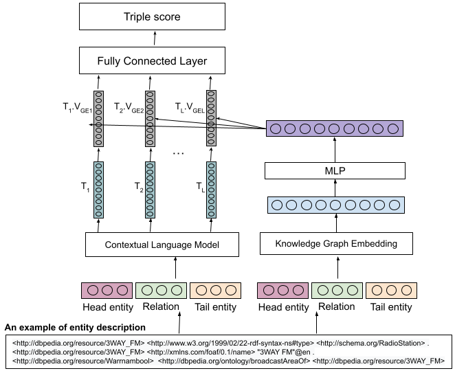

# ESLM
##  Improving entity summarization by leveraging languagemodels

<p align="center">

</p>

## Dataset

On this experiment, we used two datasets:
1. [ESBM (version 1.2)](https://github.com/nju-websoft/ESBM/tree/master/v1.2) that consists of 175 entities related to 150 entities from DBpedia and 25 entities from LinkedMDB.
2. FACES dataset.

## Environment and Dependency

### Environment

* Ubuntu 10.04.2 LTS
* python 3.6+
* pytorch 1.7.0

## Installation
```
https://github.com/dice-group/ESLM.git
```

### To train/testing the ESLM model with ERNIE

```
python run_eslm_ernie.py --mode {train, test}
```

### To train/testing the ESLM model with enrichment ERNI with KGE

```
python run_eslm_ernie_kge.py --mode {train, test}
```

### Run Ensemble Learning on the ESLM model with ERNIE

```
python run_eslm_ernie_kge_ens.py --mode test
```

### To train/testing the ESLM model with BERT

```
python run_eslm_bert.py --mode {train, test}
```

### To train/testing the ESLM model with enrichment BERT with KGE

```
python run_eslm_bert_kge.py --mode {train, test}
```

### Run Ensemble Learning on the ESLM model with BERT

```
python run_eslm_bert_kge_ens.py --mode test
```

### Run to evaluate an example result.
```
cd evaluator
bash run.sh
```

## Contact
If you have any questions or feedbacks, feel free to contact us at asep.fajar.firmansyah@uni-paderborn.de
