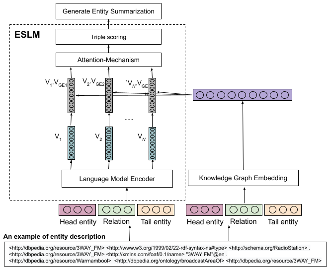

# ESLM: Improving entity summarization by leveraging language models

The ESLM model is designed to efficiently perform entity summarization tasks. At its core, ESLM utilizes a language model augmented with an attention mechanism, allowing for context-aware processing and prediction. This mechanism ensures that the model focuses on the most relevant aspects of data sequences. Additionally, ESLM employs a Multi-Layer Perceptron (MLP) for accurate triple scoring, which aids in selecting the most relevant triples for each entity. To augment the model’s effectiveness, we also enriched it with knowledge graph embeddings (KGE), leveraging their rich semantic information.

<p align="center">

</p>

## Dataset

On this experiment, we used two datasets:
1. [ESBM (version 1.2)](https://github.com/nju-websoft/ESBM/tree/master/v1.2) includes 175 entities, comprising 150 entities sourced from DBpedia and 25 entities from LinkedMDB.
2. FACES dataset is made up of 50 entities.

## Environment and Dependency

### Environment

* Ubuntu 10.04.2 LTS
* python 3.6+
* pytorch 1.7.0

## Installation
```
https://github.com/u2018/ESLM.git
```

## ESLM Framework

Currently, ESLM framework includes a selection of three highly effective models for entity summarization tasks as follows:
1. BERT (Bidirectional Encoder Representations from Transformers)
2. ERNIE (Enhanced Representation through kNowledge Integration)
3. T5 (Text-to-Text Transfer Transformer)

To utilize these models in the ESLM framework, you simply need to reference them by their lowercase names in the command line. For instance:

1. To use BERT, you would type bert.
2. For ERNIE, type ernie.
3. And for T5, enter t5

### Usage information

```
main.py [-h] [--train] [--no-train] [--test] [--no-test] [--enrichment] [--no-enrichment] [--model MODEL] [--max_length MAX_LENGTH] [--epochs EPOCHS] [--learning_rate LEARNING_RATE]
```

### ESLM

Training and evaluating the model using the standard settings
```
python main.py --model t5  --no-enrichment
```

Evaluating only
```
python main.py --model t5  --no-enrichment --no-train
```


### ESLM Enrichment with KGE

Training and evaluating the model using the standard settings
```
python main.py --model t5
```

Evaluating only
```
python main.py --model t5 --no-train
```

## How to Cite
```bibtex
@inproceedings{ESLM2024,
  author = {Firmansyah, Asep Fajar and Mousallem, Diego and Ngonga Ngomo, Axel-Cyrille},
  booktitle = {The Semantic Web},
  title = {ESLM: Improving Entity Summarization by Leveraging Language Models},
  url = {https://doi.org/10.1007/978-3-031-60626-7_9},
  year = 2024
}

```

## Contact
If you have any questions or feedbacks, feel free to contact us at asep.fajar.firmansyah@upb.de
